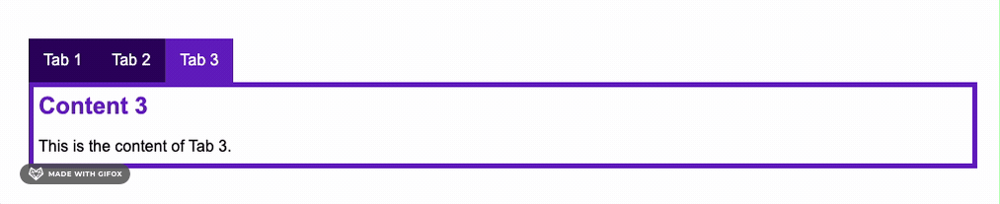

# Task: Conditional rendering

There exists a tab content block. It has two parts: the tab navigator and the content. 
The current active tab should be always in sync with the displayed content.
Use `conditional rendering` and `class binding` to achieve this.

## Fulfill the following tasks:

- [ ] Use the data property `activeTab` to set a tab as active
- [ ] Use `v-on` directive to change the active tab after clicking one of the tabs.
- [ ] Use v-if to display the right content block.
- [ ] Use class binding to highlight the active tab with the css class `tab-box__nav-item--active`
- [ ] Content and tab should be always in sync.
- [ ] Display a excuse fallback text when there is no match for an active tab.
  - This could happen when `activeTab` is higher or lower than the amount of available tabs

