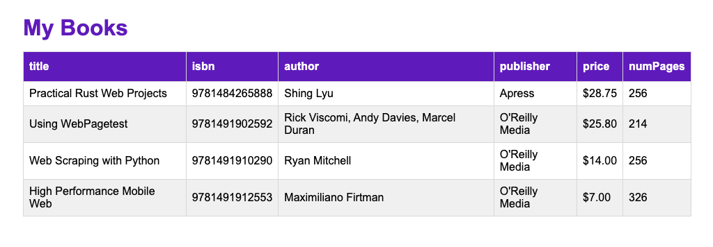

# Task: List rendering

The task is about rendering a table of books that are provided by a data property `books` by using `list rendering`.

## Fulfill the following tasks:

- [ ] Generate the table head by getting the `keys` of one book.
  - Tipp: `Object.keys(books[0])`
- [ ] Display all books in the table with the `v-for` directive
  - Don't forget to use the `key` directive

## Hint

- With Object.keys() you can get an array with only the keys of an Object